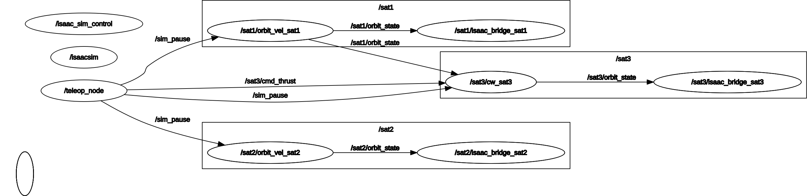

# SLI CubeSat Orbital Mechanics Simulation
## Isaac Sim 5.1 + ROS2 Jazzy

> **ITAR NOTE: Does not contain ITAR files.**

Sierra Lobo Inc CubeSat proximity operations simulation. Physics runs entirely outside Isaac Sim as standalone ROS2 nodes. Isaac Sim is renderer only, driven via the `simulation_interfaces` standard. The orbital math has no GPU dependency and can be tested independently.


---

## Architecture

```
External ROS2 process (Python 3.12, system Jazzy)
+─────────────────────────────────────────────────+
│  orbit_vel_node  (one per body, role: orbit)     │
│    RK4 integrator -> publishes /satN/orbit_state │
│                                                  │
│  cw_node  (one per body, role: cw)               │
│    Hill's equations -> publishes /satN/orbit_state│
│    subscribes to chief's orbit_state             │
│                                                  │
│  isaac_bridge_node  (one per body)               │
│    subscribes orbit_state -> /set_entity_state   │
│                                                  │
│  scene_loader_node  (runs once at startup)       │
│    /spawn_entity -> /play -> exits               │
│                                                  │
│  orbit_control_node  (optional supervisor)       │
│    pause/resume, time stepping, warp factor      │
+─────────────────────────────────────────────────+
              |  ROS2 DDS (FastRTPS)
              v
Isaac Sim process (Python 3.11, internal Jazzy)
+─────────────────────────────────────────────────+
│  isaacsim.ros2.sim_control extension             │
│    /spawn_entity  /set_entity_state              │
│    /set_simulation_state  /get_entities  ...     │
+─────────────────────────────────────────────────+
```

Physics has zero Isaac Sim dependency. All nodes are pure Python and can be unit tested without a GPU.

---

## Repository Structure

```
SLI-5.1-cubesat_project/
├── build_ros.sh                    # Docker build script (Python 3.11 binaries)
├── dockerfiles/
│   └── ubuntu_24_jazzy_python_311_minimal.dockerfile
├── jazzy_ws/                       # Host workspace (Python 3.12, for ROS2 nodes)
│   ├── fastdds.xml                 # FastDDS UDP config (required)
│   └── src/
│       ├── isaacsim/               # NVIDIA Isaac Sim ROS2 launcher package
│       ├── orbit_interfaces/       # Custom ROS2 messages + services
│       │   ├── msg/
│       │   │   ├── OrbitState.msg
│       │   │   └── ThrustCmd.msg
│       │   └── srv/
│       │       ├── SpawnBody.srv
│       │       └── StepIntegration.srv
│       ├── sli/                    # Main simulation package
│       │   ├── config/
│       │   │   └── orbit_scene.yaml
│       │   ├── launch/
│       │   │   └── orbit.launch.py
│       │   ├── scripts/
│       │   │   ├── scene_loader_node.py
│       │   │   ├── orbit_vel_node.py
│       │   │   ├── cw_node.py
│       │   │   ├── isaac_bridge_node.py
│       │   │   └── orbit_control_node.py
│       │   ├── usd_files/
│       │   │   └── earth/
│       │   │       └── earthmodel.usd
│       │   └── urdf/
│       │       ├── bigsat/bigsat.usd
│       │       └── smallsat/smallsat.usd
│       └── sli_gnc/                # C++ GNC package (builds on host only)
│           └── src/
│               └── teleop_node.cpp
└── build_ws/                       # Docker build output (Python 3.11 binaries)
    └── jazzy/
        ├── jazzy_ws/install/
        └── isaac_sim_ros_ws/install/
```

---

## Prerequisites

### Cesium for Omniverse (NEEDED FOR TERRAIN STREAMING)

Cesium for Omniverse adds a full-scale WGS84 globe and streaming 3D terrain
into Isaac Sim via Cesium ion. It is used in this project for Earth terrain
visualization. The extension is free and open source, but terrain streaming
requires a Cesium ion account (free tier available).

**1. Create a Cesium ion account**

Sign up at https://cesium.com/ion/signup if you don't have one. The free tier
includes Cesium World Terrain and Bing Maps Aerial imagery.

**2. Install Cesium for Omniverse**

Cesium for Omniverse ships bundled with Isaac Sim 5.1, no separate download
needed. Enable it from inside Isaac Sim:

- Open Isaac Sim
- Go to Window > Extensions
- Search for `cesium.omniverse`
- Toggle it on

It loads automatically when `earthmodel.usd` is opened since the USD references
it.

**3. Connect to Cesium ion**

Once enabled, the Cesium panel appears in the Isaac Sim sidebar. Click
"Connect to Cesium ion" and sign in. This generates an access token saved to
your local Omniverse config.

> The `earthmodel.usd` included in this repo is a clean sphere with no Cesium
> prims. This is intentional -- Cesium ion server relationship prims baked into
> a USD file cause crashes on load. To add terrain, open the stage after launch
> and add a Cesium tileset through the GUI.

**Troubleshooting**

The `pip install lxml` errors that appear in the Isaac Sim log at startup are
normal and harmless. If terrain does not appear, check that your ion token is
valid at https://cesium.com/ion/tokens.

### System
- Ubuntu 24.04 (Zorin 18 and other Ubuntu based distros confirmed working)
- NVIDIA GPU, driver >= 535
- Docker (for building Python 3.11 custom message binaries)
- NVIDIA Isaac Sim 5.1 installed at `/isaac-sim`
- ROS2 Jazzy (system apt, Python 3.12)
- Cesium installed on Isaac Sim

### ROS2 packages
```bash
sudo apt install ros-jazzy-simulation-interfaces
```

> `simulation_interfaces` must be the system apt version. Do not build it from source into `jazzy_ws` -- Isaac Sim's internal `.so` files are compiled against the apt version and will crash otherwise.

---

## Setup

### 1. Build custom messages (Docker -- Python 3.11 for Isaac Sim)

```bash
cd ~/SLI-5.1-cubesat_project
git submodule update --init --recursive
sudo ./build_ros.sh -d jazzy -v 24.04
```

Output lands at:
- `build_ws/jazzy/jazzy_ws/install/` -- Python 3.11 Jazzy base
- `build_ws/jazzy/isaac_sim_ros_ws/install/` -- Python 3.11 custom messages

### 2. Build host workspace (Python 3.12 -- for ROS2 nodes)

```bash
source /opt/ros/jazzy/setup.bash
cd ~/SLI-5.1-cubesat_project/jazzy_ws
colcon build
source install/local_setup.bash
```

---

## Running

> Isaac Sim + Cesium can be temperamental at startup. If the launch fails, Ctrl-C and try again. It usually works within 2-3 attempts.

### Terminal 1 -- Isaac Sim

```bash
source /opt/ros/jazzy/setup.bash
cd ~/SLI-5.1-cubesat_project/jazzy_ws
source install/local_setup.bash
export FASTRTPS_DEFAULT_PROFILES_FILE=~/SLI-5.1-cubesat_project/jazzy_ws/fastdds.xml
ros2 launch isaacsim run_isaacsim.launch.py \
  install_path:=/isaac-sim \
  ros_distro:=jazzy \
  use_internal_libs:=true \
  exclude_install_path:=$(pwd)/install \
  ros_installation_path:=$(pwd)/../build_ws/jazzy/jazzy_ws/install/local_setup.bash,$(pwd)/../build_ws/jazzy/isaac_sim_ros_ws/install/local_setup.bash \
  custom_args:="--/isaac/startup/ros_sim_control_extension=True" \
  gui:=$(ros2 pkg prefix sli)/share/sli/usd_files/earth/earthmodel.usd
```

Wait for: `Isaac Sim Full App is loaded.`

### Terminal 2 -- ROS2 nodes

Open a fresh terminal:

```bash
source /opt/ros/jazzy/setup.bash
export FASTRTPS_DEFAULT_PROFILES_FILE=~/SLI-5.1-cubesat_project/jazzy_ws/fastdds.xml
cd ~/SLI-5.1-cubesat_project/jazzy_ws
source install/local_setup.bash
ros2 launch sli orbit.launch.py
```

### Terminal 3 -- Orbit control supervisor (optional)

```bash
source /opt/ros/jazzy/setup.bash
export FASTRTPS_DEFAULT_PROFILES_FILE=~/SLI-5.1-cubesat_project/jazzy_ws/fastdds.xml
cd ~/SLI-5.1-cubesat_project/jazzy_ws
source install/local_setup.bash
ros2 run sli orbit_control_node
```

Run with time warp (see [Orbit Control](#orbit-control) below):
```bash
ros2 run sli orbit_control_node --ros-args -p warp_factor:=100.0
```

### Terminal 4 -- Teleop

```bash
source /opt/ros/jazzy/setup.bash
export FASTRTPS_DEFAULT_PROFILES_FILE=~/SLI-5.1-cubesat_project/jazzy_ws/fastdds.xml
cd ~/SLI-5.1-cubesat_project/jazzy_ws
source install/local_setup.bash
ros2 run sli_gnc teleop_node --ros-args -p target:=sat1 -p thrust_mag:=0.01
```

To control a different satellite, change the target:
```bash
ros2 run sli_gnc teleop_node --ros-args -p target:=sat3 -p thrust_mag:=0.10 #or 0.01, You can change magnitude. 
```

Two teleop instances can run at the same time, one per satellite.

### What happens at launch

1. `scene_loader_node` waits for Isaac Sim services, calls `/spawn_entity` for each body marked `spawn: true`, then calls `/set_simulation_state -> PLAYING` and exits.
2. `orbit_vel_node` instances start integrating (RK4) and publish `OrbitState` at 30 Hz.
3. `cw_node` subscribes to the chief's `OrbitState`, integrates Hill's equations, publishes the deputy's `OrbitState`.
4. `isaac_bridge_node` instances subscribe to each body's orbit state and call `/set_entity_state` to move prims every frame.

---

## Teleoperation



Keyboard teleop for controlling satellites. All thrust commands are in the LVLH frame (radial, along-track, cross-track). `orbit_vel_node` rotates to inertial automatically. `cw_node` applies directly to Hill's equations since its state is already in LVLH.

```bash
ros2 run sli_gnc teleop_node --ros-args -p target:=sat1 -p thrust_mag:=0.01
```

Key bindings:

| Key | Action |
|-----|--------|
| `i` / `k` | +/- along-track (fy) |
| `l` / `j` | +/- radial (fx) |
| `u` / `o` | +/- cross-track (fz) |
| `Space` | zero thrust |
| `P` | pause / resume |
| `Q` | quit |

`thrust_mag` is the acceleration magnitude in km/s² per keypress. The default `1e-4` is too small to produce visible movement at the current orbital scale -- use `0.01` as a starting point and tune from there.

---

## Thrust Commands (manual)

Thrust commands use Cartesian LVLH format. The old gimbal angle format (`throttle`, `gimbal_pitch`, `gimbal_yaw`) is no longer used.

Apply a prograde burn to sat1:
```bash
ros2 topic pub --once /sat1/cmd_thrust orbit_interfaces/msg/ThrustCmd \
  "{header: {frame_id: 'lvlh'}, body_id: '/World/Sat1', fx: 0.0, fy: 0.01, fz: 0.0}"
```

Apply a radial burn to sat3:
```bash
ros2 topic pub --once /sat3/cmd_thrust orbit_interfaces/msg/ThrustCmd \
  "{header: {frame_id: 'lvlh'}, body_id: '/World/Sat3', fx: 0.01, fy: 0.0, fz: 0.0}"
```

Zero out thrust:
```bash
ros2 topic pub --once /sat1/cmd_thrust orbit_interfaces/msg/ThrustCmd \
  "{header: {frame_id: 'lvlh'}, body_id: '/World/Sat1', fx: 0.0, fy: 0.0, fz: 0.0}"
```

Monitor orbit state:
```bash
ros2 topic echo /sat1/orbit_state
ros2 topic hz /sat1/orbit_state    # should be ~30 Hz
```

ThrustCmd fields:
- `fx` -- radial acceleration (km/s²), positive = away from Earth
- `fy` -- along-track acceleration (km/s²), positive = prograde
- `fz` -- cross-track acceleration (km/s²), positive = orbit normal

---

## Orbit Control

`orbit_control_node` is a supervisor that sits on top of the existing nodes. It does not run any physics -- it just controls the simulation clock.

### Pause / Resume

```bash
ros2 service call /orbit_control/pause std_srvs/srv/SetBool "{data: true}"
ros2 service call /orbit_control/pause std_srvs/srv/SetBool "{data: false}"
```

Pause is atomic -- it gates all physics nodes via `/sim_pause` and freezes the Isaac Sim renderer via `/set_simulation_state` simultaneously.

### Time Stepping

Step N integration ticks then auto-pause. The service returns immediately and stepping runs in the background.

```bash
# Step ~1 second of sim time (120 ticks at dt_sim=0.00833)
ros2 service call /orbit_control/step orbit_interfaces/srv/StepIntegration \
  "{steps: 120, dt_sim: 0.0}"

# Cancel a running step
ros2 service call /orbit_control/cancel std_srvs/srv/Trigger "{}"
```

### Warp Factor

`warp_factor` compresses wall-clock time during a step. At `warp_factor: 1.0` (default), stepping 120 ticks takes 1 real second. At `warp_factor: 100.0` it takes 10ms.

```bash
ros2 run sli orbit_control_node --ros-args -p warp_factor:=100.0
```

Note: warp only affects how long the step window stays open. The physics nodes always integrate at their own timer rate -- at high warp many orbits worth of integration will complete before the step closes.

---

## Configuration -- `orbit_scene.yaml`

```yaml
workspace_root: ${ORBIT_WS}

world:
  base_scene: usd_files/earth/earthmodel.usd
  skip_load_world: true

simulation:
  mu: 398600.4418    # km^3/s^2
  dt_sim: 0.00833    # ~1/120 s

bodies:
  - name: earth
    prim_path: /World/Earth
    role: attractor
    spawn: false

  - name: sat1
    prim_path: /World/Sat1
    role: orbit
    spawn: true
    usd: urdf/bigsat/bigsat.usd
    attractor: /World/Earth
    orbit:
      type: circular
      radius: 6778000
      plane: xy
    scale: 1.0

  - name: sat2
    prim_path: /World/Sat2
    role: orbit
    spawn: true
    usd: urdf/smallsat/smallsat.usd
    attractor: /World/Earth
    orbit:
      type: elements
      a: 6778000
      e: 0.01
      inc: 28.5
      raan: 0.0
      argp: 0.0
      nu: 45.0
    scale: 1.0

  - name: sat3
    prim_path: /World/Sat3
    role: cw
    spawn: true
    usd: urdf/smallsat/smallsat.usd
    attractor: /World/Earth
    chief: /World/Sat1
    orbit:
      type: cw_relative
      dr: [1.0, 0.0, 0.5]    # initial relative pos, LVLH frame
      dv: [0.0, 0.001, 0.0]  # initial relative vel, LVLH frame
    scale: 1.0
```

---

## Known Issues

**`simulation_interfaces` version** -- the system apt version must be used. Do not build it from source into `jazzy_ws`.

**FastDDS required** -- every terminal must export `FASTRTPS_DEFAULT_PROFILES_FILE` before launch. Without it, Isaac Sim's ROS2 services are invisible to external nodes.

**`use_internal_libs:=true` required** -- ensures Isaac Sim uses its own bundled ROS2 libraries rather than the system ones, preventing Python 3.11/3.12 `.so` version mismatches.

**Cesium crash** -- `earthmodel.usd` must not contain Cesium ion server relationship prims. The included USD is a clean sphere. Add Cesium terrain through the Isaac Sim GUI after launch if needed.

**Orbital scale** -- current parameters use `mu = 398600.4418 km^3/s^2` with `radius = 6778000` (mismatched units). This is intentional for visualization -- satellites move slowly enough for Isaac Sim's camera to track. Physically correct parameters (`radius: 6778` km) give a ~92-minute orbital period but the satellites move too fast for the default camera setup.

**Thrust magnitude** -- the default `thrust_mag` of `1e-4 km/s^2` in teleop is too small to produce visible movement at the current orbital scale. Use `0.01` or higher.

---

## Development Notes

### Two Python environments

| Environment | Python | Used for |
|---|---|---|
| Docker build output | 3.11 | Isaac Sim internal ROS2 bridge, custom message `.so` files |
| System ROS2 Jazzy | 3.12 | All simulation nodes |

`sli_gnc` (C++) builds on the host with system Jazzy and is excluded from the Docker build.

### Rebuild after node changes

```bash
cd ~/SLI-5.1-cubesat_project/jazzy_ws
colcon build --packages-select sli
source install/local_setup.bash
```

### Rebuild after message changes (requires Docker)

```bash
cd ~/SLI-5.1-cubesat_project
sudo ./build_ros.sh -d jazzy -v 24.04
cd jazzy_ws
colcon build --packages-select orbit_interfaces
source install/local_setup.bash
```

### Adding a new body

1. Add an entry to `orbit_scene.yaml` with the appropriate `role`, `usd`, and `orbit` fields
2. No code changes needed -- `orbit.launch.py` generates nodes dynamically from config
3. Rebuild `sli`