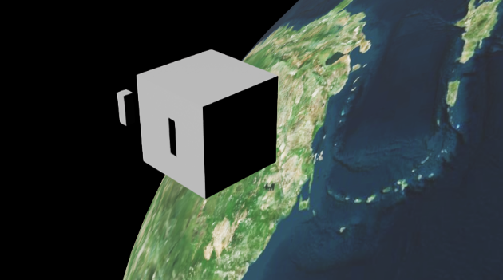
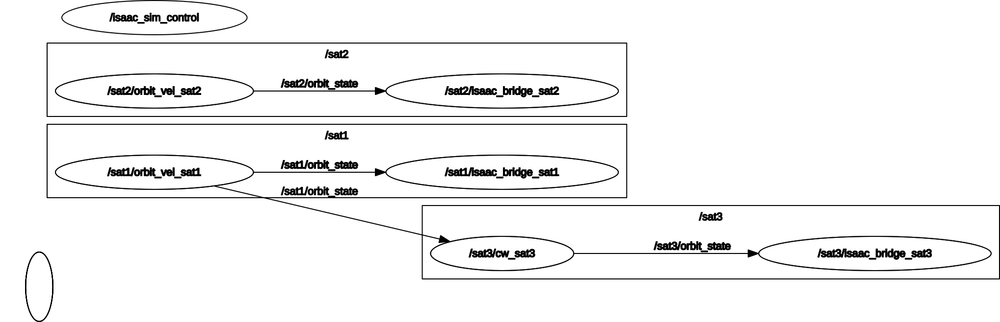

# SLI CubeSat Orbital Mechanics Simulation
## Isaac Sim 5.1 + ROS2 Jazzy

# DOES NOT HAVE CLASSIFIED/ITAR FILES YET

Sierra Lobo Inc, CubeSat orbital mechanics simulation using NVIDIA Isaac Sim 5.1 and ROS2 Jazzy. Physics runs as pure ROS2 nodes outside Isaac Sim. Isaac Sim is used as a renderer only, controlled via the `simulation_interfaces` standard.

[](./Screencast%20from%202026-04-08%2014-18-51.webm)




---

## Architecture

```
External ROS2 process (Python 3.12, system Jazzy)
┌─────────────────────────────────────────────────┐
│  orbit_vel_node  (one per body, role: orbit)     │
│    RK4 integrator → publishes /satN/orbit_state  │
│                                                  │
│  cw_node  (one per body, role: cw)               │
│    Hill's equations → publishes /satN/orbit_state│
│    subscribes to chief's orbit_state             │
│                                                  │
│  isaac_bridge_node  (one per body)               │
│    subscribes orbit_state → /set_entity_state    │
│                                                  │
│  scene_loader_node  (runs once at startup)       │
│    /spawn_entity → /play → exits                 │
└─────────────────────────────────────────────────┘
              │  ROS2 DDS (FastRTPS)
              ▼
Isaac Sim process (Python 3.11, internal Jazzy)
┌─────────────────────────────────────────────────┐
│  isaacsim.ros2.sim_control extension             │
│    /spawn_entity  /set_entity_state              │
│    /set_simulation_state  /get_entities  ...     │
└─────────────────────────────────────────────────┘
```

Key principle: **physics has zero Isaac Sim dependency**. Nodes are pure Python and can be unit tested without a GPU.

---

## Repository Structure

```
SLI-5.1-cubesat_project/
├── build_ros.sh                    # Docker build script (Python 3.11 binaries)
├── dockerfiles/
│   └── ubuntu_24_jazzy_python_311_minimal.dockerfile
├── jazzy_ws/                       # Host workspace (Python 3.12, for ROS2 nodes)
│   ├── fastdds.xml                 # FastDDS UDP config (required)
│   └── src/
│       ├── isaacsim/               # NVIDIA Isaac Sim ROS2 launcher package
│       ├── orbit_interfaces/       # Custom ROS2 messages
│       │   └── msg/
│       │       ├── OrbitState.msg
│       │       └── ThrustCmd.msg
│       └── sli/                    # Main simulation package
│           ├── CMakeLists.txt
│           ├── package.xml
│           ├── config/
│           │   └── orbit_scene.yaml
│           ├── launch/
│           │   └── orbit.launch.py
│           ├── scripts/
│           │   ├── scene_loader_node.py
│           │   ├── orbit_vel_node.py
│           │   ├── cw_node.py
│           │   └── isaac_bridge_node.py
│           ├── usd_files/
│           │   └── earth/
│           │       └── earthmodel.usd
│           └── urdf/
│               ├── bigsat/
│               │   └── bigsat.usd
│               └── smallsat/
│                   └── smallsat.usd
└── build_ws/                       # Docker build output (Python 3.11 binaries)
    └── jazzy/
        ├── jazzy_ws/install/       # Source before running Isaac Sim
        └── isaac_sim_ros_ws/install/
```

---

## Prerequisites

### System
- Ubuntu 24.04 (Zorin 18 confirmed working)
- NVIDIA GPU with driver ≥ 535
- Docker (for building Python 3.11 custom message binaries)
- NVIDIA Isaac Sim 5.1 (workstation install at `/isaac-sim`)
- ROS2 Jazzy (system apt install, Python 3.12)

### ROS2 packages
```bash
sudo apt install ros-jazzy-simulation-interfaces
```

> **Important:** `simulation_interfaces` must be the system apt version. Do **not** build it from source into `jazzy_ws` — Isaac Sim's internal `.so` files are compiled against the apt version and will crash with any other build.

---

## Setup

### 1. Build custom messages (Docker, Python 3.11 — for Isaac Sim)

```bash
cd ~/SLI-5.1-cubesat_project
git submodule update --init --recursive
sudo ./build_ros.sh -d jazzy -v 24.04
```

Output at:
- `build_ws/jazzy/jazzy_ws/install/` — Python 3.11 Jazzy base
- `build_ws/jazzy/isaac_sim_ros_ws/install/` — Python 3.11 custom messages

### 2. Build host workspace (Python 3.12 — for ROS2 nodes)

```bash
source /opt/ros/jazzy/setup.bash
cd ~/SLI-5.1-cubesat_project/jazzy_ws
colcon build
source install/local_setup.bash
```

---

## Running

### Terminal 1 — Isaac Sim

```bash
source /opt/ros/jazzy/setup.bash
cd ~/SLI-5.1-cubesat_project/jazzy_ws
source install/local_setup.bash
export FASTRTPS_DEFAULT_PROFILES_FILE=~/SLI-5.1-cubesat_project/jazzy_ws/fastdds.xml

ros2 launch isaacsim run_isaacsim.launch.py \
  install_path:=/isaac-sim \
  ros_distro:=jazzy \
  use_internal_libs:=true \
  exclude_install_path:=/home/sgq/SLI-5.1-cubesat_project/jazzy_ws/install \
  ros_installation_path:=/home/sgq/SLI-5.1-cubesat_project/build_ws/jazzy/jazzy_ws/install/local_setup.bash,/home/sgq/SLI-5.1-cubesat_project/build_ws/jazzy/isaac_sim_ros_ws/install/local_setup.bash \
  custom_args:="--/isaac/startup/ros_sim_control_extension=True"
```

Wait for: `Isaac Sim Full App is loaded.`

### Terminal 2 — ROS2 nodes

Open a **fresh terminal**:

```bash
source /opt/ros/jazzy/setup.bash
export FASTRTPS_DEFAULT_PROFILES_FILE=~/SLI-5.1-cubesat_project/jazzy_ws/fastdds.xml
cd ~/SLI-5.1-cubesat_project/jazzy_ws
source install/local_setup.bash
ros2 launch sli orbit.launch.py
```

### What happens at launch

1. `scene_loader_node` waits for Isaac Sim services, calls `/spawn_entity` for each body with `spawn: true`, calls `/set_simulation_state → PLAYING`, then exits.
2. `orbit_vel_node` instances start integrating (RK4) and publish `OrbitState` at 30 Hz.
3. `cw_node` subscribes to chief's `OrbitState`, integrates Hill's equations, publishes deputy `OrbitState`.
4. `isaac_bridge_node` instances subscribe to orbit state and call `/set_entity_state` to move prims each frame.

---

## Configuration — `orbit_scene.yaml`

```yaml
workspace_root: ${ORBIT_WS}

world:
  base_scene: usd_files/earth/earthmodel.usd
  skip_load_world: true   # Isaac Sim opens USD directly; skip /load_world ROS service

simulation:
  mu: 398600.4418    # km³/s²
  dt_sim: 0.00833   # ~1/120 s

bodies:
  - name: earth
    prim_path: /World/Earth
    role: attractor
    spawn: false

  - name: sat1
    prim_path: /World/Sat1
    role: orbit
    spawn: true
    usd: urdf/bigsat/bigsat.usd
    attractor: /World/Earth
    orbit:
      type: circular
      radius: 6778000
      plane: xy
    scale: 1000.0       # km→m conversion for Isaac Sim

  - name: sat2
    prim_path: /World/Sat2
    role: orbit
    spawn: true
    usd: urdf/smallsat/smallsat.usd
    attractor: /World/Earth
    orbit:
      type: elements
      a: 6778000
      e: 0.01
      inc: 28.5
      raan: 0.0
      argp: 0.0
      nu: 45.0
    scale: 1000.0

  - name: sat3
    prim_path: /World/Sat3
    role: cw            # Clohessy-Wiltshire deputy
    spawn: true
    usd: urdf/smallsat/smallsat.usd
    attractor: /World/Earth
    chief: /World/Sat1
    orbit:
      type: cw_relative
      dr: [1.0, 0.0, 0.5]    # initial relative pos LVLH frame (km)
      dv: [0.0, 0.001, 0.0]  # initial relative vel LVLH frame (km/s)
    scale: 1000.0
```

---

## Sending Thrust Commands

Apply a prograde impulse to sat1:

```bash
ros2 topic pub --once /sat1/cmd_thrust orbit_interfaces/msg/ThrustCmd \
  "{header: {frame_id: 'world'}, body_id: '/World/Sat1', \
    throttle: 0.1, gimbal_pitch: 0.0, gimbal_yaw: 1.5708}"
```

Monitor orbit state:

```bash
ros2 topic echo /sat1/orbit_state
ros2 topic hz /sat1/orbit_state    # should be ~30 Hz
```

---

## Known Issues & Limitations

**`simulation_interfaces` version** — Isaac Sim 5.1 bundles its own internal build of `simulation_interfaces`. The system apt version (`ros-jazzy-simulation-interfaces`) must be used by external nodes. Do not build `simulation_interfaces` from source into `jazzy_ws`.

**FastDDS required** — both terminals must export `FASTRTPS_DEFAULT_PROFILES_FILE` pointing to `fastdds.xml` before launching. Without this, Isaac Sim's ROS2 services are not visible to external nodes.

**`use_internal_libs:=true` required** — the `run_isaacsim.launch.py` launcher must use `use_internal_libs:=true` and `exclude_install_path` pointing to the jazzy_ws install. This ensures Isaac Sim uses its own bundled ROS2 libraries.

**Cesium crash** — `earthmodel.usd` must not contain Cesium ion server relationship prims. The included USD is a clean sphere. To add Cesium terrain, do so through the Isaac Sim GUI after launch.

**Orbital scale** — orbit math runs in km. `scale: 1000.0` converts km → m for Isaac Sim. At true LEO scale (6778 km radius) the orbital period is ~92 minutes.

---

## Development Notes

### Two Python environments

| Environment | Python | Used for |
|---|---|---|
| Docker build output | 3.11 | Isaac Sim internal ROS2 bridge, custom message `.so` files |
| System ROS2 Jazzy | 3.12 | `orbit_vel_node`, `cw_node`, `isaac_bridge_node`, `scene_loader_node` |

### Rebuilding after node changes

```bash
cd ~/SLI-5.1-cubesat_project/jazzy_ws
colcon build --packages-select sli
source install/local_setup.bash
```

### Rebuilding after message changes (requires Docker)

```bash
cd ~/SLI-5.1-cubesat_project
sudo ./build_ros.sh -d jazzy -v 24.04
cd jazzy_ws
colcon build --packages-select orbit_interfaces
source install/local_setup.bash
```

### Adding a new body

1. Add entry to `orbit_scene.yaml` with appropriate `role`, `usd`, `orbit` fields
2. No code changes needed — launch file generates nodes dynamically from config
3. Rebuild `sli` package